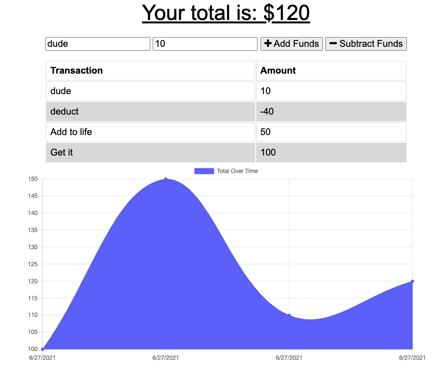

# Budget Tracker (PWA)

## Description

Budget Tracker is a PWA that allows users to track their budgets by adding expenses and deposits to their budget through the "Add/Subtract Funds" buttons.  When a user enters a transaction while offline, these transactions are stored in the indexedDB, and transferred to the database when the user comes back online.

## Table of Contents

- [Installation](#installation)
- [Usage](#usage)
- [Example Usage](#example-usage)
- [License](#license)
- [Contributing](#contributing)
- [Questions](#questions)

## Installation

To install the required dependencies, run `npm install`

## Usage

To start the server, run `npm start`, then go to http://localhost:3001 in your browser.

## Example Usage

Deployed App: https://zp-budget-tracker.herokuapp.com/

Screenshot of app below...

## License

MIT License - see the [LICENSE](LICENSE) for details.

